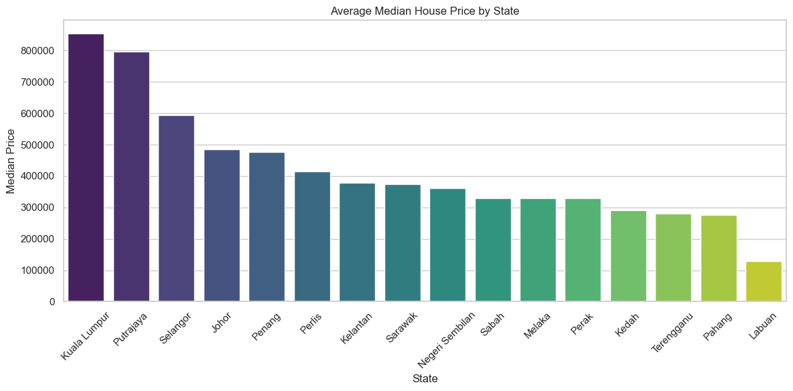
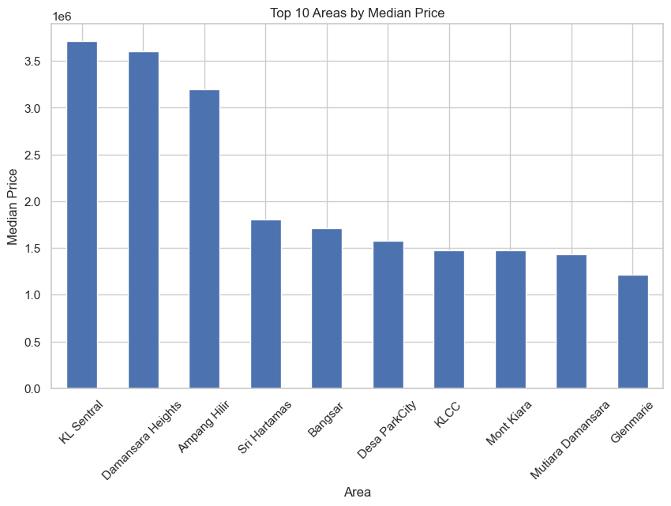
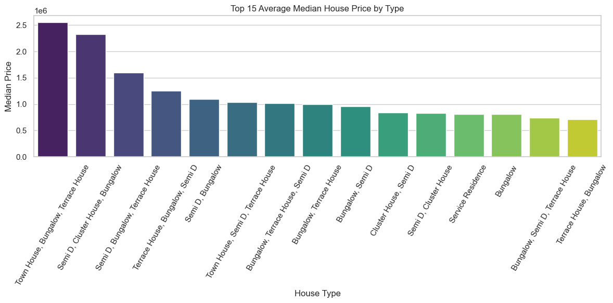

# 🏠 Malaysia House Price Analysis (2025)

## Overview
This repository contains an exploratory data analysis (EDA) of Malaysia house price data for 2025.  
The analysis focuses on median prices, price-per-square-foot (PSF)，property types, tenure, and transaction counts across townships, areas, and states. The goal is to surface regional patterns and provide insights that may help buyers and analysts.

> ⚠️ *Note: This project was created by a beginner as a way to practice and apply newly learned data analysis skills. It may not be perfect, but it reflects ongoing learning and growth.*

## Dataset
- **File location**: `data/house_prices_2025.csv`
- **Source**: [https://www.kaggle.com/datasets/lyhatt/house-prices-in-malaysia-2025]
- **Record count**: (2000, 8)
- **Main columns**:
  - `Township` — specific township / neighborhood
  - `Area` — broader area / district (NOT property size)
  - `State` — Malaysian state (e.g., Selangor, Penang, Johor)
  - `Tenure` — Freehold or Leasehold
  - `Type` — Property type (e.g., Terrace, Apartment, Bungalow)
  - `Median_Price` — median transaction price (MYR)
  - `Median_PSF` — median price per square foot (MYR / PSF)
  - `Transactions` — number of transactions recorded

## Objectives
1. Compare median housing prices by **state** and **area**.  
2. Compare `Median_PSF` and `Median_Price` by property `Type`.  
3. Analyze tenure differences (Freehold vs Leasehold).  
4. Identify top / bottom townships by median price and transaction volume.  
5. Visualize price distributions, boxplots and regional hotspots.

## Project structure
Malaysia house price analysis/
│
├── data/ # Dataset (CSV files)
├── images/ # Exported charts and visualizations
├── notebooks/ # Jupyter Notebooks for data analysis
├── README.md # Project documentation

└── .gitignore # Files to ignore in Git

## Analysis Workflow
1. **Data Loading** – Import CSV into Pandas DataFrame.
2. **Data Cleaning** – Handle missing values, ensure correct data types, and standardize column names.
3. **Exploratory Data Analysis (EDA)** – Statistical summaries, group comparisons, and correlation analysis.
4. **Visualization** – Price trends, heatmaps, and property-type comparisons.
5. **Insights & Conclusions** – Highlight key findings and possible market implications.

## Tools Used
- Python (Pandas, NumPy)
- Matplotlib & Seaborn
- Jupyter Notebook

##  Current Status
✅ Data loaded
✅ Data cleaned
🔄 Exploratory Data Analysis (in progress)

## 🖥️ How to Use
```bash
# Clone this repository
git clone https://github.com/Lpx-0128/Malaysia-House-Price-2025.git

# Install dependencies
pip install -r requirements.txt
```

## 📊 Visualizations

### 🏠 Average Median House Price by State


### 📍 Top 10 Areas by Median Price


### 🏘️ Average Median House Price by Property Type


## Conclusion

Based on the analysis of the Malaysian housing price dataset:

- **Top 3 Most Expensive State**:
  1. 【Kuala Lumpur】 — RM【853342】
  2. 【Putrajaya】 — RM【796667】
  3. 【Selangor】 — RM【594348】

- **Top 3 Most Affordable State**:
  1. 【Labuan 】 — RM【130000】
  2. 【Pahang】 — RM【276898】
  3. 【Terengganu】 — RM【280946】

Overall, the results highlight significant price differences across different areas in Malaysia.  
These insights can be useful for home buyers, investors, and policymakers when making decisions about property investments and urban development.


